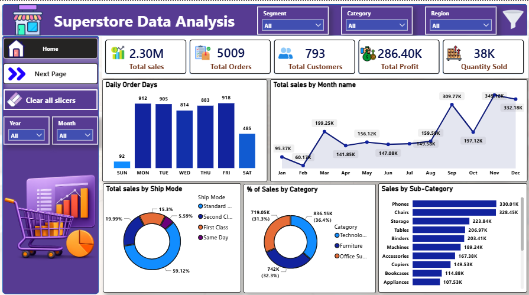
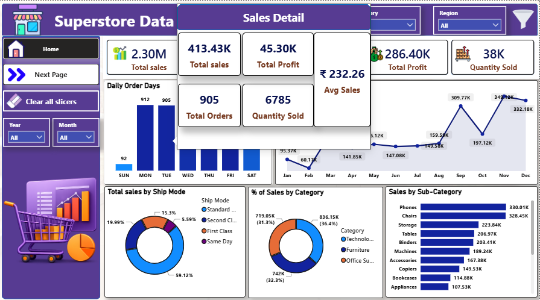
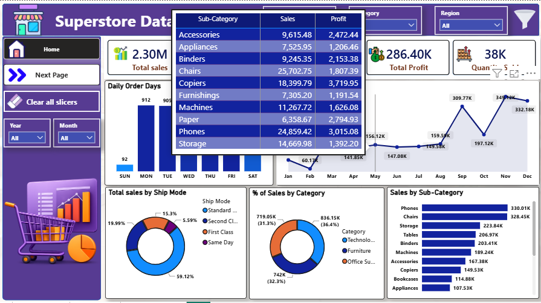

# 🛒 Superstore Sales Data Analysis Dashboard

An interactive **Power BI Sales Dashboard** built using the Superstore dataset to analyze sales performance, customer behavior, product performance, and regional trends.

---

## 📌 Project Overview

This dashboard provides actionable business insights by analyzing Superstore sales data. It includes KPI cards, interactive slicers, drill-through pages, and custom report tooltips to help users explore the data efficiently.

---

## 🛠 Tools & Technologies

- Power BI
- Power Query
- DAX
- Data Modeling
- Microsoft Excel

---

## 📊 Dashboard Features

### 🏠 Home Page
- Total Sales
- Total Orders
- Total Customers
- Total Profit
- Quantity Sold
- Daily Orders Analysis
- Monthly Sales Trend
- Sales by Ship Mode
- Sales by Category
- Sales by Sub-Category

### 📈 Sales Analysis Page
- Top 5 Products
- Top 5 Customers
- Top 5 Cities by Sales
- Sales by Region
- Sales by Segment
- Top States by Sales

### 🎯 Interactive Features
- Region Filter
- Category Filter
- Segment Filter
- Year Filter
- Month Filter
- Navigation Buttons
- Clear All Slicers Button
- Custom Report Tooltips

---

## 📷 Dashboard Preview

### 🏠 Home Dashboard



---

### 📊 Sales Analysis Dashboard


---

### 📌 Custom Sales Tooltip



---

### 📋 Product Details Tooltip



---

## 📈 Business Insights

- Identified top-performing products and customers.
- Analyzed monthly sales trends.
- Compared regional sales performance.
- Evaluated sales distribution across categories.
- Measured shipping mode contribution.
- Built interactive drill-through reports using custom tooltips.

---

## 📂 Project Structure

```
Superstore-Data-Analysis/
│
├── data/
├── images/
│   ├── Home_page.png
│   ├── Next_Page.png
│   ├── Tooltip_sales.png
│   └── tooltip_details.png
│
├── Dashboard.pbix
├── README.md
└── LICENSE
```

---

## 👨‍💻 Author

**Shantanu Khobragade**

Aspiring Data Analyst

### Skills

- Power BI
- Python
- SQL
- Excel
- DAX
- Power Query

---

⭐ If you found this project useful, consider giving it a Star!
